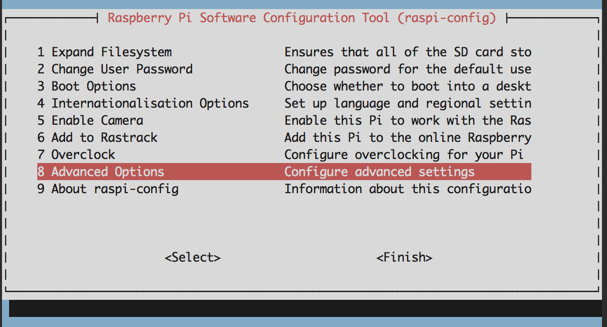
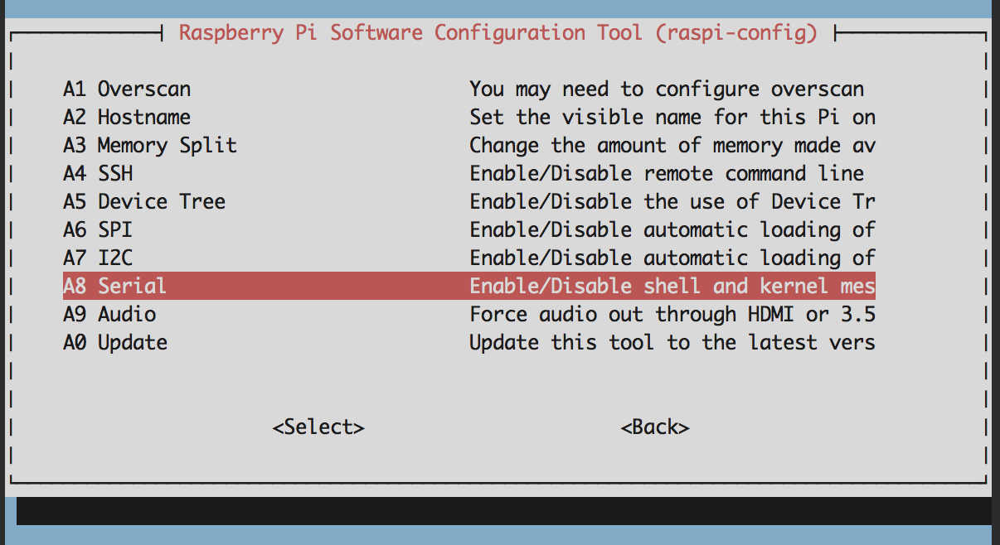
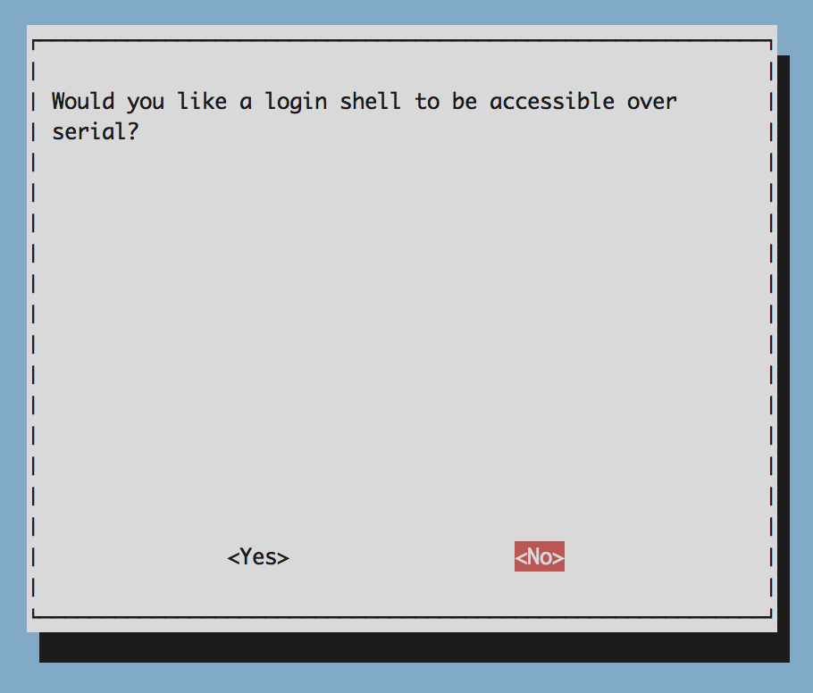

This tutorial suggests using the current, latest release of Raspbian, nicknamed *Jessie*. You can use the previous version, nicknamed *Wheezy* as well, but keep in mind that the instructions will not be the same for both.

If you're using Jessie, continue this tutorial with **Option 1**. If you have Wheezy and would like to upgrade to Jessie, here are some instructions. If you have Wheezy and want to stay with Wheezy, jump down to **Option 2**.

#Option 1 (recommended)

###1. Installing Libraries

We'll need `pip` for getting some Python Modules for our code later as well as two python modules [`pynmea2`](https://github.com/Knio/pynmea2) for parsing [NMEA Sentences](https://en.wikipedia.org/wiki/NMEA_0183) from the GPS and [`ISStreamer`](https://github.com/InitialState/python_appender) for streaming GPS data to Initial State for near real-time visualization.

```
$ sudo apt-get install python-pip
$ sudo pip install pynmea2
$ sudo pip install ISStreamer
```

>NOTE: Some GPS/Raspberry Pi tutorials will walk you through using USB serial (extra hardware required) or use HW UART and interface with the GPS via `cgps` libraries. For this tutorial, we'll be using the Raspberry Pi's HW UART and will be skipping `cgps` all together to avoid extra setup requirements and extra dependencies and code that aren't necessary for this particular tutorial.

###2. Configure Raspberry Pi UART Serial

We'll need to free up Raspberry Pi's Hardware UART in order to read the serial communications from the GPS Breakout Board. By default, Raspbian is configured to attach a console to `ttyAMA0` to send shell and kernal messages over this serial channel. There are three ways to change this setting based on how you're interfacing with the Raspberry Pi.

#####Option A: Commandline (works over SSH)
```
$ sudo nano /boot/cmdline.txt
```
Remove `console=ttyAMA0,115200` from the config.

Previous:

```
dwc_otg.lpm_enable=0 console=ttyAMA0,115200 console=tty1 root=/dev/mmcblk0p6 roo tfstype=ext4 elevator=deadline fsck.repair=yes rootwait
```

Edited:

```
dwc_otg.lpm_enable=0 console=tty1 root=/dev/mmcblk0p6 rootfstype=ext4 elevator=deadline fsck.repair=yes rootwait
```

#####Option B: Commandline UI (works over SSH)
```
$ sudo raspi-config
```



Select Option `8 Advanced Options`



Select Option `A8 Serial`



Select `<No>`

Then you may be prompted to restart your Raspberry Pi, select `<No>`. We'll reboot at the end.

#####Option C: Through Raspbian Desktop (doesn't work over SSH)

Raspbian provides a UI to edit the raspi-config settings from the desktop as well by going to Configuration and following similar steps as the `raspi-config` ui steps as described in Option B.


###2. Disable serial-getty on `ttyAMA0`

```
$ sudo systemctl disable serial-getty@ttyAMA0.service
```

###3. Reboot

```
$ sudo reboot now
```

[<< Part 1. Equipment](1 Part 1. Equipment) - [Part 1. Hardware Configuration >>](3 Part 1. Hardware Configuration)