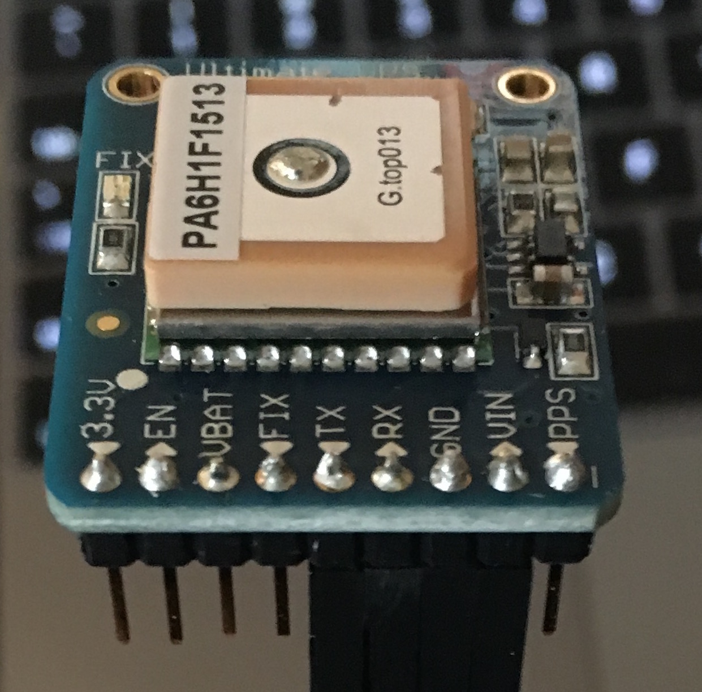
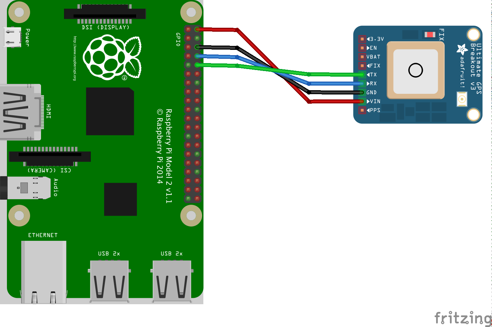
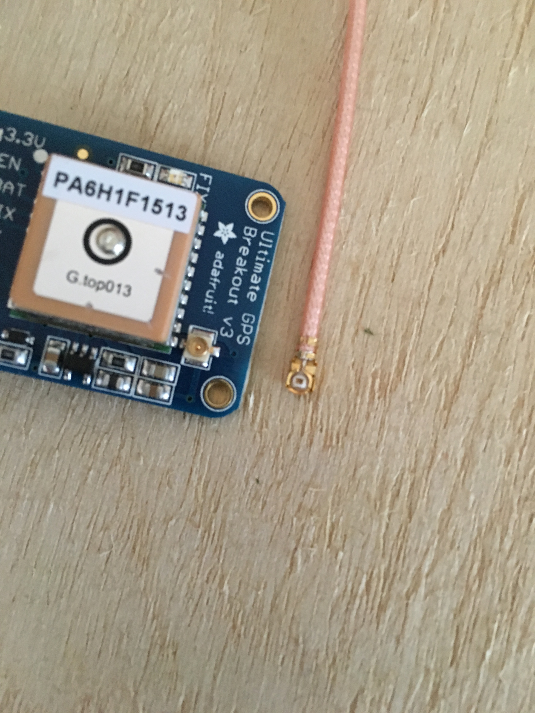
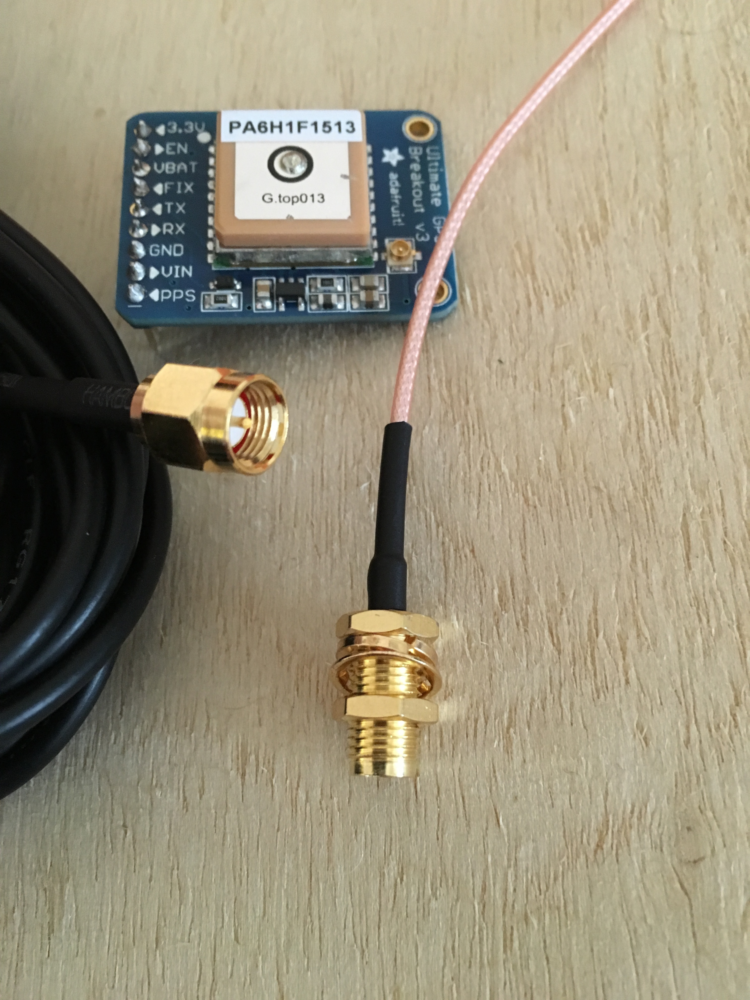

Since we'll be setting this up using Raspberry Pi's HW UART, we'll only a simple  4 jumper wire configuration.

###1. Soldering Ultimate GPS Breakout

The Adafruit Ultimate GPS Breakout board comes with the board, some header pins, and a CR1220 battery holder. You'll need to solder the header pins on to the board for some simple wiring.

If you've never done any soldering before, I recommend you get some spare header pins, a breadboard, and a prema-proto board to practice on. Adafruit has some [nice tutorials](https://learn.adafruit.com/adafruit-guide-excellent-soldering/tools) on soldering. The scope of this tutorial doesn't include soldering for the sake of simplicity.

The soldered board looks like this:

###2. Wiring the GPS to the Pi

>**NOTE**: Make sure your Pi is *powered down* for this step.

Notice that the wiring includes 4 wires, this is where you'll use your Female/Female jumper wires since the Pi has header pins built in and we just soldered the header pins on to the GPS Breakout Board.

Wirings:

- GPS VIN <-> RPi VOUT
- GPS GND <-> RPi GND
- GPS RX <-> RPi UART_TX
- GPS TX <-> RPi UART_RX

>Note: RX and TX connections on the GPS and Pi are cross-wired, i.e. TX of one goes to RX of the other and vice-versa.

###3. Connecting the uFL to SMA connector

The Adafruit Ultimate GPS Breakout Board contains a convenient onboard uFL male interface right below the 'V3' lettering. The uFL to CMA adapter should connect directly to this and the antenna will screw into the CMA side of the adapter.

###4. Antenna Placement

Make sure the Antenna is placed in an area where it has clear line of site to some sky. GPS requires at least 3 satellite fixes in order to triangulate a geographic position and at least 4 to get an altitude deminsion.

[<< Part 1. Raspberry Pi Setup](2 Part 1. Raspberry Pi Setup) - [Part 1. Configuring Serial and Testing >>](4 Part 1. Configuring Serial and Testing)