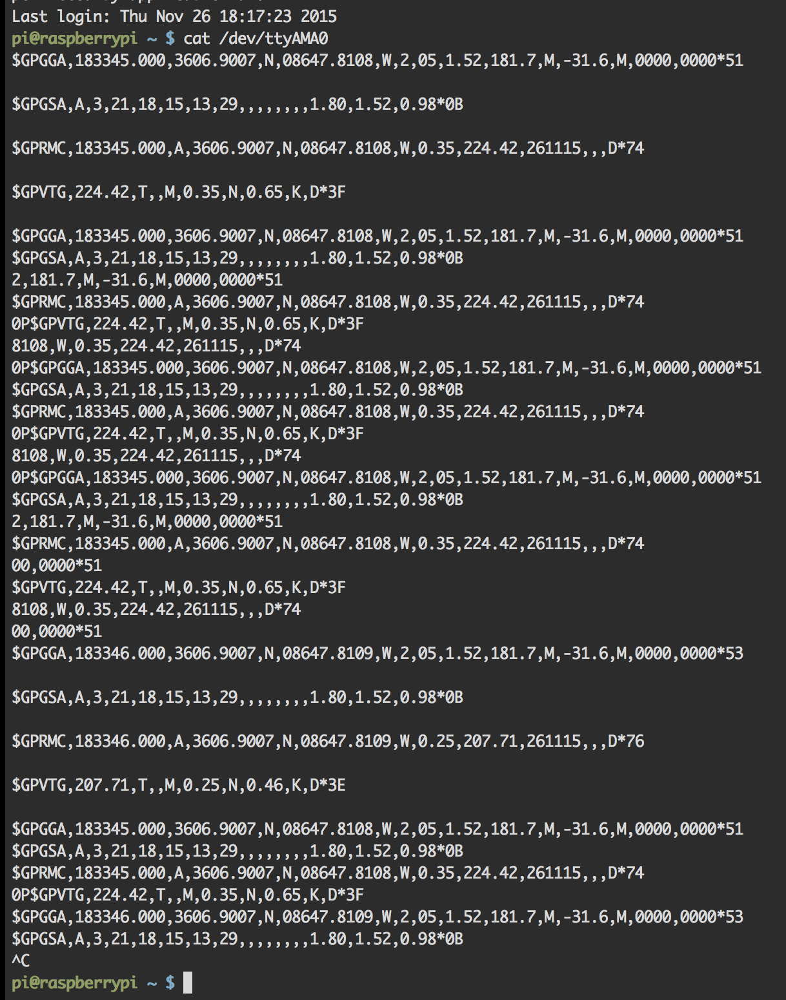

Now that the hardware and OS are setup and configured properly, we'll route the serial and test to make sure it's working correctly.

###1. Configure Serial

This command will configure the serial device so that we can listen to it.

```
$ stty -F /dev/ttyAMA0 raw 9600 cs8 clocal -cstopb
```

###2. Test For Proper NMEA Output

You can now listen to `/dev/ttyAMA0` and if configured correctly, it should stream NMEA Sentences.

```
$ cat /dev/ttyAMA0
```

You should see output like the following if everything is working and your GPS has a fix.



Note the NMEA sentence output looks like this:

```
$GPGGA,183345.000,3606.9007,N,08647.8108,W,2,05,1.52,181.7,M,-31.6,M,0000,0000*51
$GPGSA,A,3,21,18,15,13,29,,,,,,,,1.80,1.52,0.98*0B
2,181.7,M,-31.6,M,0000,0000*51
$GPRMC,183345.000,A,3606.9007,N,08647.8108,W,0.35,224.42,261115,,,D*74
0P$GPVTG,224.42,T,,M,0.35,N,0.65,K,D*3F
8108,W,0.35,224.42,261115,,,D*74
```

What we care the most about here are the lines that begin with `$GPGGA` which stands for Global Positioning System Fix Data. In this line, you can see comma separated values that indicate time, coordinates, fix status, sattelite count, altitude and many other values. For the full list of values included in a GGA sentence, [see here](http://aprs.gids.nl/nmea/#gga).

###Debugging

#####Only commas after `$GPGGA`
If you're only seeing a bunch of commas after `$GPGGA` you may not have a GPS Fix. To help, Adafruit but a very helpful LED on the GPS Breakout Board that flashes red every 1 second when it's searching for a sattelite fix and every 15 seconds when it's received a GPS fix.

#####No output when running `cat /dev/ttyAMA0`
If `cat /dev/ttyAMA0` doesn't return anything, you may need to try configuring serial again by running the command in Step 1 of this page. If you're sure this is setup correctly and still aren't getting anything. Check your TX/RX wiring. If you have TX <-> TX and RX <-> RX you won't get anything here, likewise, if you don't have the wires connected securly you also won't get anything here. Ensure the Fix LED on the breakout board is flashing.

[<< Part 1. Hardware Configuration](3 Part 1. Hardware Configuration) - [Part 2. Application Development >>](5 Part 2. Application Development)