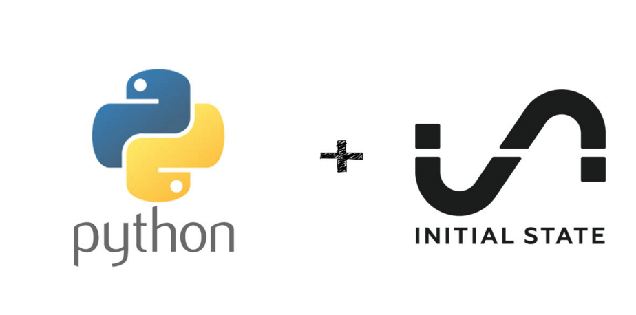

We'll be writing an application in Python to parse the NMEA Sentences coming across serial `/dev/ttyAMA0` and then streaming them near real-time to Initial State to view the data on a nice map with route tracing.

- [Python Application](6 Part 2. Python Application)
- [Data Streaming](7 Part 2. Data Streaming)