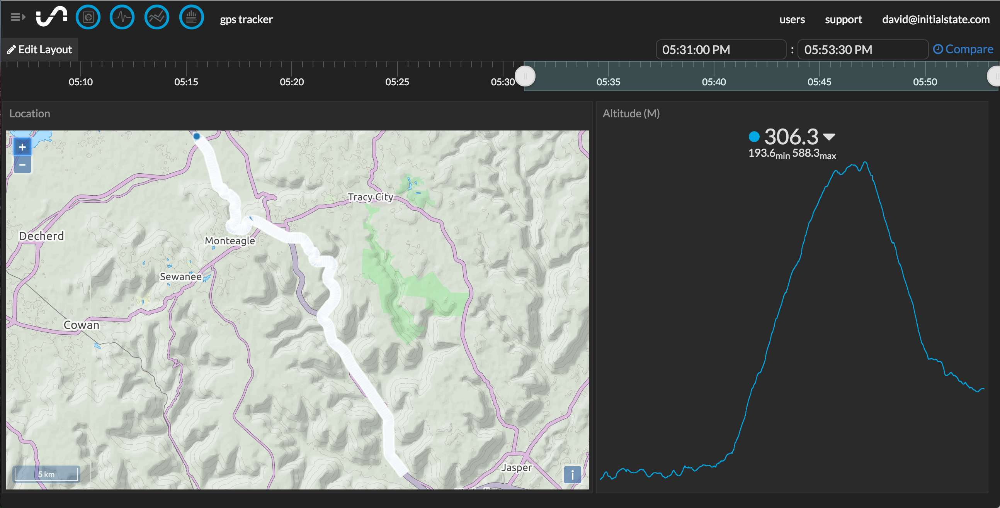

Now that we have coordinate and altitude data, we'll stream those points to Initial State for a near real-time visualization of the device's location.

###1. Get an Initial State Access Key

If you have an Initial State account, you can go to [https://www.initialstate.com/app/#/account](https://www.initialstate.com/app/#/account) to get a Streaming Access Key.

If you don't have an Initial State account, getting one is free and easy. All you need is an email address and a password. You can register at [https://www.initialstate.com/app/#/register](https://www.initialstate.com/app/#/register).

You're access key will look like this `BbDc3yOCexamplegbmuTBbzu2GSIC1Yq` but will be unique to your account. This is something you won't want to share with anyone else and therefore will be something you'll want to keep out of code should you share your code in a public repository.

###2. Refactor Python and Implement Initial State

First we'll refactor the Python code to make it a little more robust.

```python
import serial
import pynmea2
import time
from ISStreamer.Streamer import Streamer

serialStream = serial.Serial("/dev/ttyAMA0", 9600, timeout=0.5)

# construct a streamer instance with information to append to or create 
# a bucket and an ini file location that contains the Initial State 
# Account Access Key.
streamer = Streamer(bucket_name="GPS Tracker", bucket_key="GPS_Tracker_20151126", ini_file_location="./isstreamer.ini")

try:
	while True:
		sentence = serialStream.readline()
		if sentence.find('GGA') > 0:
			data = pynmea2.parse(sentence)
			streamer.log("Location", "{lat},{lon}".format(lat=data.latitude,lon=data.longitude))
			streamer.log("Altitude ({unit})".format(unit=data.altitude_units), data.altitude)
			
			# sleep for half a second before reading again
			time.sleep(.5)
except KeyboardInterrupt:
	streamer.close()
```

Your config (in the same directory as the `app.py` should look like this with your key instead of the `example_key`:

```
[isstreamer.client_config]
access_key: example_key
```

###3. Testing

You should now be able to test out the script with the following command:

```
$ python app.py
```

When you log in to your Initial State account, you should see a "GPS Tracker" bucket. When you select this bucket and select the "Tiles" application, you should see a map of the GPS coordinates like so:



[<< Part 2. Python Application](6 Part 2. Python Application) - [Part 3. Making It Mobile >>](7 Part 3. Making It Mobile)