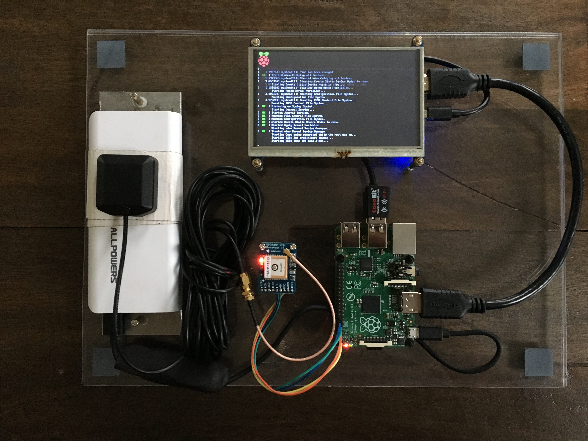
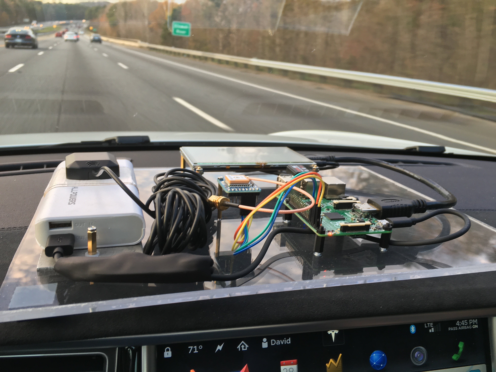

I mounted everything onto a prototype layout board that I made to keep it all together while doing some moving tests.

You can see on this plexiglass board that I've mounted a simple USB rechargeable battery. Since the Raspberry Pi is easily powered by USB, using a portable, rechargeable battery is an easy mobile power solution. This isn't the best in terms of weight and size, but it gives us an idea and doesn't require anything special.

Now that I have everything mounted on this board, I can also easily put it in my car to take for a drive while the GPS runs and collects data.

>DISCLAIMER: Don't play with your project while you're driving! Even if you have autopilot. You should always focus first on driving and being safe on the road. I had an assistent with me in the vehicle who helped keep us safe while we moved about the road.

[<< Part 3. Making It Mobile](8 Part 3. Making It Mobile) - [Part 3. Mobile Data >>](10 Part 3. Mobile Data)