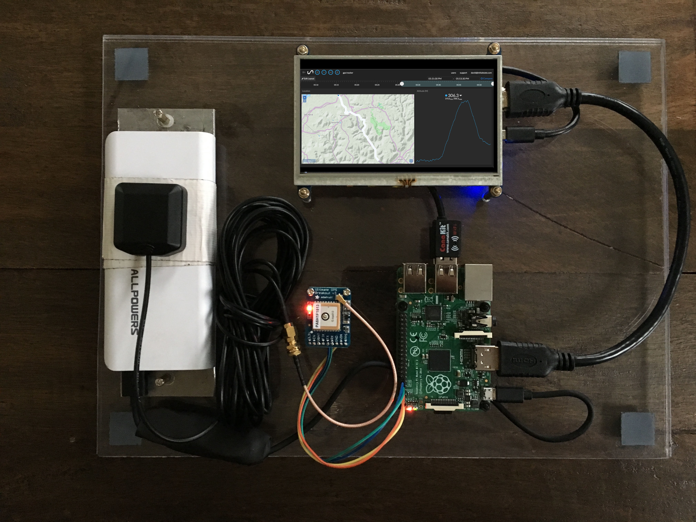

#Raspberry Pi GPS Tracker
-----

###Goal
Utilize the Raspberry Pi portable single-board computer as a foundation of a mobile GPS tracking device.

I researched many ways to accomplish this task without having to utilize superflous hadware or purchase harware that is difficult to attain. The Raspberry Pi's proliference as a mobile computing platform makes it the perfect candidate for projects like this. While some may say the Raspberry Pi has a few shortcomings when it comes to maker/internet connected projets, these are easily overcome to make for an incredibly powerful, easy-to-use computing platform at the heart of any project.

This tutorial will work step-by-step through building and programming a GPS Tracking device that is capable of streaming it's coordinates to Initial State for a near real-time map view.

[Part 1: Hardware Setup >>](0 Part 1. Hardware Setup)